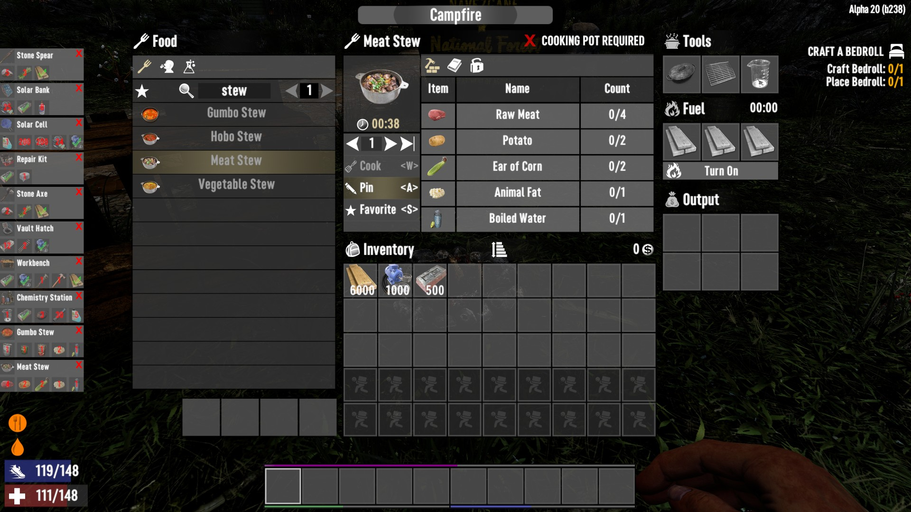
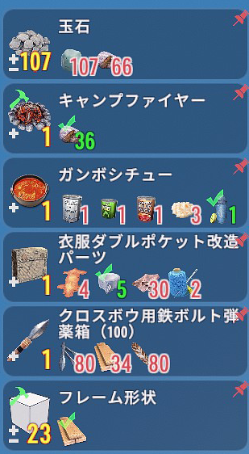
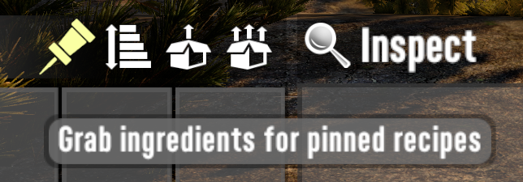

# OCB Advanced Pin Recipes Mod - 7 Days to Die (V1.0) Addon

A small harmony mod enabling to pin recipes on the UI.

Needs to be installed client and server side. And both need
EAC (Easy Anti-Cheat) to be turned off! There is no server-side
only version of this mod as it contains custom code. The mod
must also be installed on dedicated servers if you want to
use it in that setup, to persist pinned recipes for users.

Tip: Set your UI foreground opacity in video settings to 95%.
Otherwise all foreground items are forced to be fully opaque.

The craft & clear button is still a bit experimental, as
I had to copy a bit more code than wanted in order to do
all the necessary checks. So there is a chance that I
missed a few edge cases in that regard. Please report
here on GitHub if you find any issues with it.

[![GitHub CI Compile Status][5]][4]

## Feature overview

- Pin Multiple Recipes on to the side of your HUD.
- Use scroll wheel on pins to change queued amount.
- Use hammer icon to build recipe in open workstation/backpack.
- Double click on ingredients in the pins to queue them up too.
- Press "Alt" and use scroll wheel to select alternative recipes.
- Press "Alt+Shift" and scroll, to select quality (if applicable).
- Press "Shift" and click "+/-" or scroll for 10x inc-/decrement.
- Use "G" Hot-Key to grab required ingredients from open chests.
- Note: default "G" key-binding can be disabled/changed in xml.

## Grab ingredients QOL feature

With version 0.6.0 I've added another Quality of Life feature.
Loot containers (e.g. your own storage chests) and vehicle
containers get an additional button next to the "sort container"
button. When you press this "grab ingredient" button, it will try
to load as many items from the container as the pinned recipes
require. For even more convenience, this action is also available
by pressing `G` while the container is open. This key-binding
can be adjusted (or removed) in the XML config if required.

Currently the same button is also shown as a hand above the
pinned recipes. This is mostly to make users aware of this
feature and might be removed in the future. It may also be
helpful if your UI overwrites the item stack controller.

## Download and Install

End-Users are encouraged to download my mods from [NexusMods][1].  
Every download there helps me to buy stuff for mod development.

Otherwise please use one of the [official releases][3] here.  
Only clone or download the repo if you know what you do!

## Changelog

### Version 0.9.1

- Fix V1.0 stable (b333) compatibility
- Fix XML-Patcher for V1 compatibility
- Fix when pinning ingredients with quality

### Version 0.9.0

- First compatibility with V1.0 (exp)
- Add recipe quality alternation (alt+shift scroll)
- Shift-click on plus/minus icon for 10x inc-/decrement
- Fix UI issue with (optional) legendary parts

### Version 0.8.6

- Fix compatibility with Electricity Overhaul

### Version 0.8.5

- Remove alternate base recipes without ingredients

### Version 0.8.4

- Add controller support for grab ingredients feature

### Version 0.8.3

- Fix issue with pin action not showing in some languages

### Version 0.8.2

- Fix to remember crafting tier for pinned recipes

### Version 0.8.1

- Fix sync issue when skill magazines are read
- Use craft tier as given when recipe was pinned

### Version 0.8.0

- Update compatibility for 7D2D A21.0(b313)
- Add shift modifier for scroll wheel action
- Add alt modifier to scroll alternate recipes
- Add journal tip to highlight some hidden features

### Version 0.6.2

- Fix queuing of items with dynamic ingredient counts
- Add dynamic patching for "grab ingredients" button position  
  Updated ModXmlPatcher to version 4 for new XPath conditions

### Version 0.6.1

- Allow double click on Ingredients to pin its recipe
- Add automated translations for 27 languages via DeepL
- Fix issue when workstation tools are changed
- Fix storing recipe variants for same item name
- Correctly cleanup when world is unloaded
- Only show buttons if there are pinned recipes

### Version 0.6.0

- Add "grab ingredients" functionality
- Prepare for more compatibility patches

### Version 0.5.2

- Fix issue with persisting recipes

### Version 0.5.1

- Fix issues with new worlds/players

### Version 0.5.0

- Improves performance due to extensive caching
- Less overhead due to using more correct hooks
- Allows to change recipe count via mouse wheel
- Shows small red overlay for locked recipes

### Version 0.4.3

- Added Simplified Chinese translations (thx @future93)
- Automated deployment and release packaging

### Version 0.4.2

- Added Japanese translations (thx @RikeiR)

### Version 0.4.1

- Small UI adjustments for better readability
- [Alternative bigger UI][2] added (thx tdrhart)

### Version 0.4.0

- Fix issue when loading another map (reloading xui)
- Move window to the right side for less UI interference
- Reduce maximum amount of pinned recipes to 6
- Fix edge case with ingredients that have qualities
- Fix typo in controls.xml (pinned_recipe_ingredient_row)

### Version 0.3.4

- Moved `hasCraftArea` binding to root UI element
- Ditched fuel requirement to enqueue item to craft
- Moved some shared methods to PinRecipesManager
- Optimize updates to include all item stack changes
- Optimize and cache a few expensive calls

### Version 0.3.3

- Optimize CPU usage further (less fps drain)

### Version 0.3.2

- Fixed missing update when fuel is added
- Auto enable campfire when enqueuing recipe
- Add excess material label to show surplus

### Version 0.3.1

- Fix frame-drop issue (called update to often)
- Little UI cleanup (got rid of sprite backgrounds)

### Version 0.3.0

- Amount of items is now also pinned
- Added craft & clear recipe button
- Added increment/decrement buttons
- Only show action buttons when station is open
- Refactored data persisting to work on server
- Old pinned recipes will be lost on upgrade

### Version 0.2.0

- Persist pinned recipes over sessions
- Hide pinned recipes when game pauses
- Fixed improper recipe name displayed
- Improved UI look and feel a little
- Also allow to pin locked recipes
- Add tooltip for each ingredient
- Add static global manager class
- Recreated ULM pin icon from scratch

### Version 0.1.0

- Initial version

[1]: https://www.nexusmods.com/7daystodie/mods/1850
[2]: https://github.com/OCB7D2D/OcbPinRecipesUiTdrHart
[3]: https://github.com/OCB7D2D/OcbPinRecipes/releases
[4]: https://github.com/OCB7D2D/OcbPinRecipes/actions/workflows/ci.yml
[5]: https://github.com/OCB7D2D/OcbPinRecipes/actions/workflows/ci.yml/badge.svg
